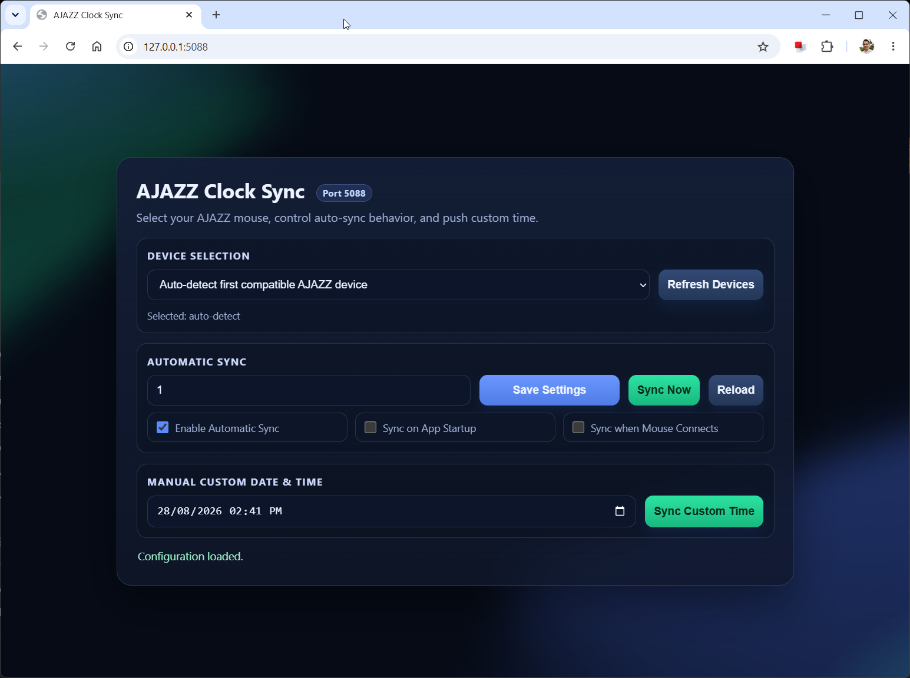

# AJAZZ Mouse Time Sync

AJAZZ Mouse Time Sync is a .NET 10 Windows app/service that syncs the onboard clock of supported AJAZZ mice over HID/USB.

## Tested Devices

Tested with:
- **AJAZZ AJ179 Apex**

Expected to work with similar models (not fully validated):
- **AJAZZ AJ199**
- **AJAZZ AJ159**

## Requirements

- **Windows 10/11**
- **.NET 10 SDK** (for build) or **.NET 10 Runtime** (for run)
- Administrator terminal is recommended for install/service operations
- A supported AJAZZ mouse connected through the expected HID interface

## Features

- Detects AJAZZ HID devices and allows selecting a specific one
- Manual **Sync Now** for current local time
- Manual custom date/time sync
- Remembers last custom date/time value
- Automatic interval sync (enable/disable + hours)
- Optional sync on app startup
- Optional sync when mouse connects
- Works as console app and Windows Service
- Live Web UI with animated background and status monitoring

## Configuration (`appsettings.json`)

```json
{
  "Ajazz": {
	"WebHost": "http://127.0.0.1:5580",
	"SelectedDevicePath": "",
	"SyncIntervalHours": 1,
	"SyncIntervalEnabled": true,
	"SyncOnStartup": true,
	"SyncOnDeviceConnect": true,
	"LastCustomDateTime": "9999-09-09T00:00"
  }
}
```

- `WebHost`: full URL binding (example: `http://127.0.0.1:5580` or `http://0.0.0.0:5580`)
- `SelectedDevicePath`: specific device path, or empty for auto-detect
- `SyncIntervalHours`: interval in hours
- `SyncIntervalEnabled`: enables/disables interval sync
- `SyncOnStartup`: enables/disables startup sync
- `SyncOnDeviceConnect`: enables/disables sync on mouse connect
- `LastCustomDateTime`: remembered value for the custom datetime input

## Precompiled Release

If you do not want to compile locally, download the precompiled release:
- https://github.com/dariofil-star/AjazzMouseTimeSynch/releases/tag/PublicRelease_2

## Run from Source

```powershell
dotnet run --project .\AjazzMouseTimeSynch\AjazzMouseTimeSynch.csproj
```

Then open your configured host URL (default):
- `http://127.0.0.1:5580`

## Run Precompiled Binary (Console Output)

1. Open **Command Prompt** (Admin recommended).
2. Go to the extracted folder:

```cmd
cd C:\Apps\AjazzMouseTimeSynch
```

3. Run:

```cmd
AjazzMouseTimeSynch.exe
```

4. Keep that console window open to view live logs.
5. Open the configured `WebHost` URL in browser.

## Publish for Service Deployment

```powershell
dotnet publish .\AjazzMouseTimeSynch\AjazzMouseTimeSynch.csproj -c Release -o C:\Apps\AjazzMouseTimeSynch
```

## Install as Windows Service

Run in elevated terminal:

```powershell
sc.exe create AjazzMouseTimeSynch binPath= "C:\Apps\AjazzMouseTimeSynch\AjazzMouseTimeSynch.exe" start= auto
sc.exe start AjazzMouseTimeSynch
```

Service management:

```powershell
sc.exe stop AjazzMouseTimeSynch
sc.exe delete AjazzMouseTimeSynch
```

## Logging

- Console mode: logs are written to terminal.
- Windows Service mode: logs are written to **Event Viewer**:
  - **Windows Logs > Application**
  - **Source**: `AjazzMouseTimeSynch`
  - Designed to log only high-signal entries (start/stop/time-updated + errors).

### Event IDs (Event Viewer)

- `1000` - Service started
- `1001` - Service stopped
- `1100` - Time sync updated successfully
- `1200` - Device change handling error
- `1201` - Time sync error

## Web UI Screenshot


